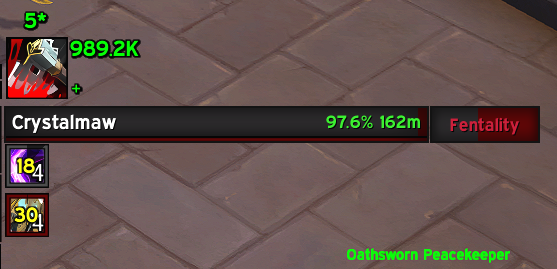

# Death Strike Helper

A World of Warcraft addon that provides real-time feedback for Death Knight's Death Strike ability, helping you optimize your healing and timing.

## Features

- Visual feedback for Death Strike healing and overhealing amounts
- Timing indicator showing optimal usage moments
- Star rating system (1-5 stars) based on healing efficiency and timing
- Customizable UI with adjustable elements and movable frame
- Sound alerts for optimal Death Strike moments (with combat-only option)
- Debug mode for troubleshooting
- Critical health detection that overrides cooldown when health is dangerously low

## Media

Screenshots showing the addon in action:

*A 3-star Death Strike showing moderate healing efficiency (716.3k healing with some overhealing)*

*A perfect 5-star Death Strike demonstrating optimal timing and healing efficiency (989.2k healing)*

## Installation

1. Download the addon
2. Extract the folder into your `World of Warcraft\_retail_\Interface\AddOns` directory
3. Restart World of Warcraft if it's running
4. Enable the addon in your addon list

## Usage

The addon automatically tracks your Death Strike usage and provides feedback:
- 💚 Green numbers show effective healing
- ❌ Red numbers show overhealing
- ➕/➖ indicators show if the timing was optimal
- ⭐ Star rating shows overall effectiveness
- 🔊 Sound alerts play when optimal conditions are met (only during combat)

### Commands

- `/dsh` - Shows available commands
- `/dsh config` - Opens the configuration panel
- `/dsh sound` - Opens sound configuration directly
- `/dsh test` - Shows test values to help with UI positioning
- `/dsh reset` - Resets the max healing seen value
- `/dsh debug` - Toggles debug mode for troubleshooting
- `/dsh status` - Shows current health, runic power, and condition status

### Configuration

Access the configuration panel through:
- `/dsh config` command
- Interface Options menu

Customize various elements including:
- Icon and text sizes
- Text positions and visibility
- Frame size and appearance
- Font settings
- Background and border options
- Sound settings and conditions
- Advanced options (debug mode)

## How It Works

### Star Rating System

The star rating (1-5 stars) is calculated based on:

1. **Healing Efficiency** (Up to 2 bonus stars)
   - +2 stars: Over 80% healing efficiency
   - +1 star: Over 60% healing efficiency
   - +0 stars: Below 60% healing efficiency

2. **Timing** (Up to 2 bonus stars)
   - +2 stars: Used at optimal Runic Power (80+ RP) or during emergency
   - +1 star: Used with adequate resources (40+ RP)
   - +0 stars: Used with poor timing

Star colors indicate rating:
- ⭐ Red (Poor)
- ⭐⭐ Orange (Fair)
- ⭐⭐⭐ Yellow (Good)
- ⭐⭐⭐⭐ Light Green (Very Good)
- ⭐⭐⭐⭐⭐ Green (Excellent)

### Timing Recommendations

The addon shows:
- ➕ Green plus when optimal to use (80+ RP or health below 50% with 40+ RP)
- ➖ Red minus when conditions aren't ideal
- Standard WoW cooldown timer and swipe animation after recent Death Strike use
- The built-in cooldown text shows tenths of seconds when under 1 second

### Sound Alert Conditions

Sound alerts can be configured to play for any of these conditions:
- **High Runic Power Cap** - When RP is at or above 105
- **High Runic Power** - When RP is at or above 80
- **Low Health** - When health is below 50% and RP is at least 40

Sounds only play during combat to prevent unnecessary alerts.

### Critical Health Override

When your health drops below 30% and you have at least 40 Runic Power, the addon will:
- Override the normal 5-second cooldown (after just 1 second)
- Recommend using Death Strike immediately
- Play the Low Health sound alert
- Show "Critical HP" in debug output
- Display a configurable text overlay ("SLAM IT" by default) on the Death Strike icon

This helps ensure you can spam Death Strike when in danger, rather than waiting for the full cooldown.

### Debug Mode

Enable debug mode with `/dsh debug` to see detailed information in your chat window:
- Current health percentage and runic power
- Which conditions are being met
- When sounds are being played or suppressed
- Cooldown status and overrides

## Requirements

- World of Warcraft Retail
- Death Knight class
- Blood specialization

## Support

For issues or suggestions, please submit them through the project's issue tracker.

## License

This addon is released under the MIT License. 